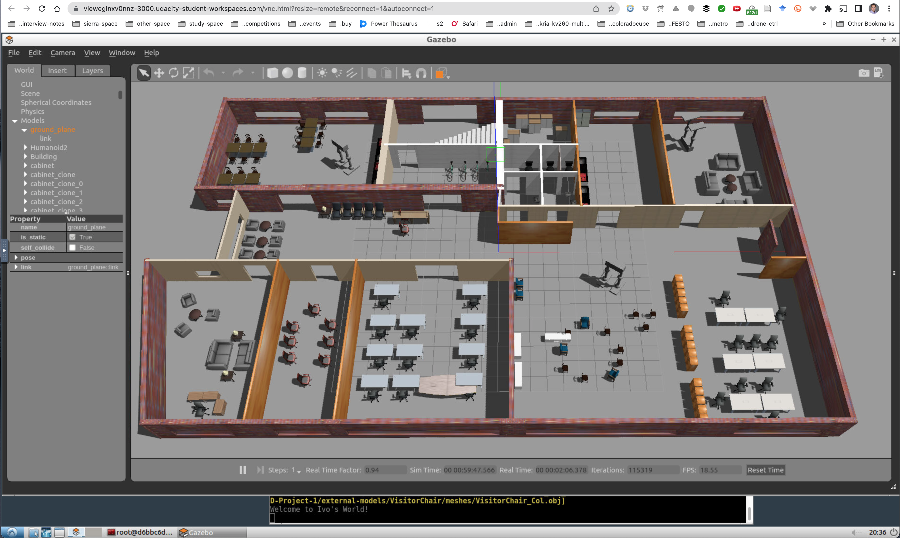

# RSEND Project 1

  

## Directory structure
```
.RSEND-Project-1  
|-- assets  
|-- |--- Contemporary-Office-2D-Floor-Plan.jpg
|-- |--- Project-1.png
|-- external_models  
|-- |--- AdjTable
|   |    |--- meshes  
|   |    |--- thumbnails  
|   |    |--- model.config  
|   |    |--- model.sdf  
|-- |--- ...
|-- model  
|   |--- Building  
|   |    |--- model.config  
|   |    |--- model.sdf  
|   |--- Humanoid2  
|   |    |--- model.config  
|   |    |--- model.sdf  
|-- script  
|   |--- hello.cpp  
|-- world  
|   |--- OfficeSpace.world  
|-- CMakeLists.txt  
|__  
```
1. The directory `assets` contains two images, one used to create the building structure.  
2. The directory `external-models` contains a lot of furniture used to decorate the world.  

## Setup
The project depends on the following two Gazebo variables, which are set in the `/home/workspace/.student_bashrc`:
1. `export GAZEBO_MODEL_PATH=/home/workspace/RSEND-Project-1/model:/home/workspace/RSEND-Project-1/external-models:$GAZEBO_MODEL_PATH`   
2. `export GAZEBO_PLUGIN_PATH=${GAZEBO_PLUGIN_PATH}:/home/workspace/RSEND-Project-1/build`  

git:  
1. The `.gitignore` template for C++ excludes `.obj` files, but all of the models in `external-models` have `.obj` files, so this rule is commented out.
2. The `build` directory is ignored for commits.
3. The sdf files in this project are essentially XML markup. When working with git/Github and highly-structured text files, especially if like Gazebo one is forced to overwrite files, one has to be very careful what the `push` and merge policies are, because simple `diff` merges can corrupt the files.

## Outstanding problems
1. As it becomes obvious from this screenshot, at some pont Gazebo stops recording or visualizing the orientations and positions of objects from the last save. The conference table should be in the conference room with the brown chairs, the nurse table should be perpendicular to the entrance and aligned with the two receptionist office chairs, and numerous chairs have to be facing in different directions. The only thing I can think of is that there are too many objects and Gazebo has some kind of rendering limit. Nothing I have tried has been able to overcome this problem.   
2. At some point, Gazebo started complaining that it can't find the material for the "VisitorChair" model, though there was never been any change to the model directory files.    
